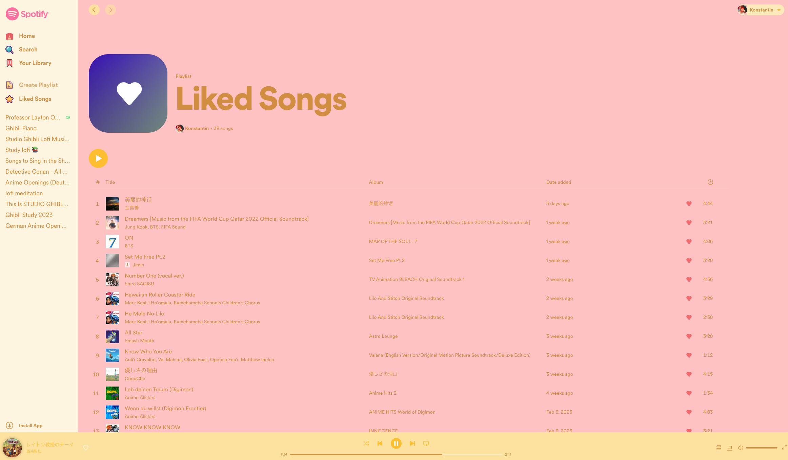

# ArcThemeForSpotify

## Feel free to use it as a template to adjust it to your liking
Once you add your own boosts to a website they will appear as extensions in Arc. There you can find their locations and remove them if necessary. 
